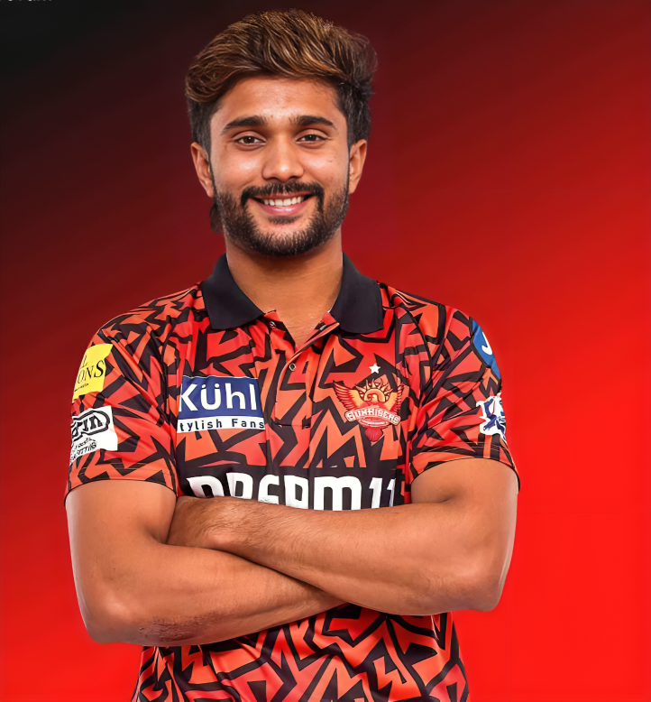

<html>
    <head>
        <link href="https://fonts.googleapis.com/css?family=Yeon+Sung&display=swap" rel="stylesheet"><meta name="viewport" content="width=device-width, initial-scale=1">
    <meta name="viewport" content="width=device-width, initial-scale=1">
<link rel="stylesheet" href="https://maxcdn.bootstrapcdn.com/bootstrap/3.4.0/css/bootstrap.min.css">

    <title>Nitish Kumar Reddy</title>
    <h1>Nitish Kumar Reddy</h1>
    <link rel="stylesheet"    href="NKR.css">
</head>
<body>
    
    <h2>Nitish Kumar Reddy (born 26 May 2003) is an Indian International cricketer who is an all-rounder.
     He bats right-handed and bowls right-arm medium fast. He plays for Andhra in domestic cricket & plays for Sunrisers Hyderabad in the Indian Premier League.
      Nitish made his T20I debut on 6 October 2024 and his Test cricket debut for India on 22 November 2024 during the 2024-25 Border Gavaskar Trophy.</h2>

      <section>
        <h3>For more info</h3>
        <a href="https://en.wikipedia.org/wiki/Nitish_Kumar_Reddy" target="_blank"> <button class="btn-info">Click Here!</button></a>
      </section>
</body>
